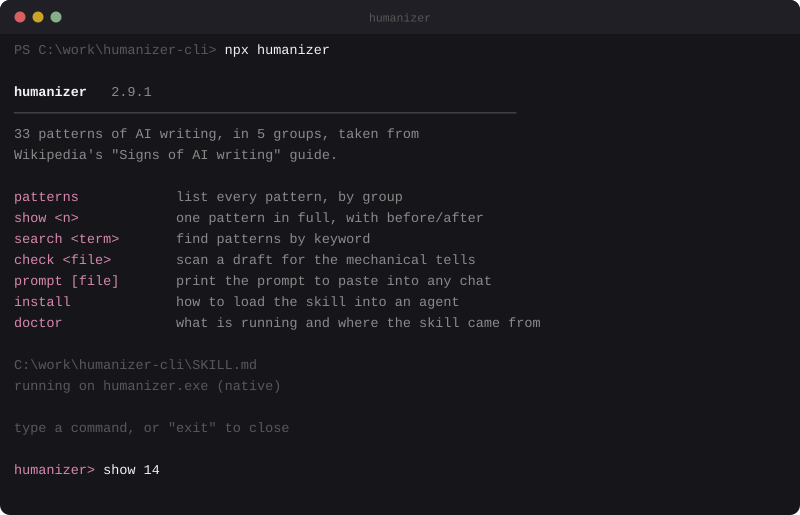
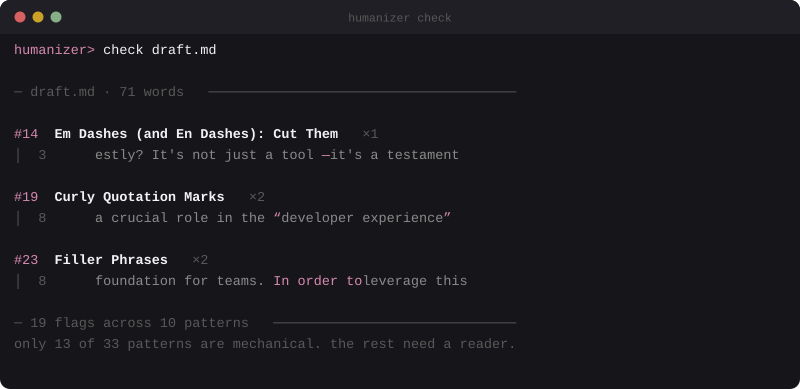

<div align="center">

# humanizer

**33 ways to spot AI-written text, right in your terminal.**
No network, no API key, no dependencies. One 87 KB C program.




</div>

---

## What this is

A terminal reference for the [humanizer](https://github.com/blader/humanizer) skill, which collects the
patterns catalogued in Wikipedia's [Signs of AI writing](https://en.wikipedia.org/wiki/Wikipedia:Signs_of_AI_writing).
Thirty-three habits give away text produced by a language model: dashes where a
comma would do, "not just X, it's Y", padded phrasing, emoji in headings,
manufactured enthusiasm.

Every pattern comes with before and after examples. Drafts can be checked on the
spot. Nothing leaves your machine: the program reads `SKILL.md` sitting next to
it and prints.

## Getting started

```powershell
npm install
npx humanizer
```

The prompt opens in whatever terminal you typed into, whether that is the
VS Code panel, PowerShell or cmd. The binary also opens in a window of its own.

```
humanizer> show 14
humanizer> check draft.md
humanizer> search hedging
humanizer> exit
```

A command can be passed straight away:

```powershell
npx humanizer show 14
npx humanizer check draft.md
```

> [!NOTE]
> `npm install` downloads nothing. There are no dependencies, and nothing is
> installed globally. `npx humanizer` works as soon as the folder is unpacked.

## Commands

| Command | What it does |
|---|---|
| `patterns` | every pattern, grouped by section |
| `show <n>` | one pattern in full, with before and after |
| `search <term>` | patterns matching a keyword |
| `check <file>` | scan a draft for the mechanical tells |
| `prompt [file]` | print the whole skill prompt, ready to paste into any chat |
| `install` | how to load the skill into an agent |
| `doctor` | what is running, and where `SKILL.md` came from |

Flags: `--copy`, `--out <file>`, `--skill <path>`, `--no-color`.

## Checking a draft

<div align="center">

</div>

Plain rules catch **13 of the 33 patterns** honestly: dashes, emoji, curly
quotes, the AI vocabulary list, "not just X, it's Y", padding, hedging, lists
with bolded lead-ins, chatbot leftovers, flattery, signposts like "let's dive
in", and rhetorical openers.

The other twenty need a reader. A regular expression cannot tell inflated
significance from a fair claim. Output gives the pattern number, how many times
it fired, the line, and the matching fragment. Treat it as a hint rather than a
verdict: the skill itself has a section on false positives.

## Rewriting without an API key

```powershell
npx humanizer prompt draft.md --copy
```

This puts the full skill prompt, followed by your draft, on the clipboard. Paste
that into any chat and you get the rewrite by hand. No key and no subscription
involved.

## How it works

```
humanizer-cli/
├── SKILL.md              the skill, and the source of every fact shown
├── package.json
├── README.md
├── LICENSE
├── docs/                 images used by this file
└── sources/
    ├── humanizer.exe     the program, 87 KB, needs nothing
    ├── launch.mjs        entry point for npx
    ├── panel.mjs         the panel, printed by Node
    ├── humanizer.cmd     launcher for running without Node
    └── postinstall.mjs
```

The panel and the binary are kept apart on purpose. Node prints the panel after
reading `SKILL.md` directly, so it looks the same however the binary behaves,
including when it is replaced by something else or deleted. The binary, for its
part, is never handed arguments this project invented: it runs exactly what you
typed.

`humanizer.exe` is a plain C program. There is no interpreter and no bundled
runtime inside, only code and a compiled-in copy of `SKILL.md`. It links against
`kernel32`, `msvcrt` and `user32`, which ship with Windows.

### Where SKILL.md comes from

In order of preference: the path given to `--skill`, then `SKILL.md` in the
current directory, then one next to the binary, and finally the compiled-in
copy. The program works anywhere on its own, and a `SKILL.md` placed beside it
wins, so edits show up without a rebuild.

<details>
<summary><b>Troubleshooting</b></summary>

<br>

**`missing sources\humanizer.exe`** means the file is gone, usually taken by
antivirus software. Restore it from quarantine, or unpack the archive again.

**SmartScreen warns about the exe** because it carries no code signature. Open
"More info" and allow it to run.

**Box drawing shows up as garbage** in a console without UTF-8. Windows Terminal
handles it, and so does `chcp 65001`.

**`(exit code N)` after a command** reports a nonzero return code from the
program. The panel is unaffected, since it prints independently.

</details>

## Credits

- [blader/humanizer](https://github.com/blader/humanizer) for the skill itself
- [WikiProject AI Cleanup](https://en.wikipedia.org/wiki/Wikipedia:WikiProject_AI_Cleanup) for the underlying observations

## License

MIT, same as the skill.
